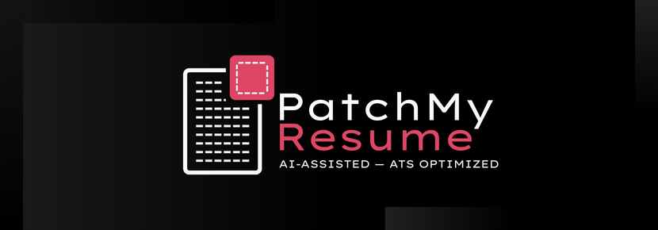

<div align="center">
  <br>
  <br>
    <picture>
      <source media="(prefers-color-scheme: light)" srcset="./src/assets/images/light.png">
      <source media="(prefers-color-scheme: dark)" srcset="./src/assets/images/dark.png">
      
    </picture>
  <br>
  <br>
</div>

<h1 align="center" style="text-transform: capitalize;">Tailoring Resume for each Job Description can be a hasle thats what caused me to create this</h1>
<p align="center" style="text-transform: capitalize;">In today's competitive job market, resumes must be perfectly optimized with keywords and phrasing specific to the target job description to pass Applicant Tracking Systems (ATS). Manually performing this optimization for every application is tedious and inefficient.</p>

<p align="center" style="margin: 0; padding: 0;">
    
    
    
    
    
    
</p>

<p align="center" style="margin: 0; padding: 0;">
    
    
    
    
</p>

<p align="center" style="margin: 0; padding: 0;">
    <a href="https://patchmyresume.joyalgeorgekj.com">
        
    </a>
    <a href="#-getting-started-installation">
        
    </a>
    <a href="#-contribution--guidance">
        
    </a>
</p>

---

## 🗺️ Table of Contents

1.  [🚀 Features & How It Works](#features--how-it-works)
2.  [🧑‍💻 Getting Started (Installation)](#getting-started-installation)
3.  [🛠️ Tech Stack](#tech-stack)
4.  [🤝 Contribution & Guidance](#contribution-guidance)
5.  [🔒 Security & Data Handling](#security-data-handling)
6.  [📌 Roadmap](#roadmap)
7.  [📝 License](#license)

---

<a name="features--how-it-works" id="features--how-it-works"></a>

## 🚀 Features & How It Works

PatchMyResume focuses on leveraging AI to create perfectly tailored resumes, maximizing your chances against Applicant Tracking Systems (ATS).

### Key Features

- **AI-Driven Tailoring:** Uses **Google Gemini** to analyze job descriptions and rewrite your resume sections for keyword matching and relevance.
- **ATS-Optimized Export:** Generates clean, structured PDF resumes that are easily parsed by ATS software using **PDF-LIB**.
- **Structured Data First:** Collects data using a strict, predefined schema to ensure consistency and quality.
- **User-Owned AI:** You provide your own API key, giving you control over usage and ensuring your data privacy.
- **Theming:** Full **System/Light/Dark** mode support powered by NextThemes.

### How It Works (The Workflow)

1.  **API Key/Model Setup:** You securely provide your Gemini API Key and select your preferred model.
2.  **Input:** You provide your structured **Resume Data** and the target **Job Description**.
3.  **AI Processing:** Your data and the job description are sent to the **Google AI (Gemini)** model. Keywords are extracted, and multiple rewritten suggestions are generated for relevant sections (like experience descriptions).
4.  **User Review:** You review the AI suggestions and dynamically choose which ones to apply to your resume.
5.  **Export:** The final, tailored resume is exported as a clean, **ATS-friendly PDF**.

---

<a name="getting-started-installation" id="getting-started-installation"></a>

## 🧑‍💻 Getting Started (Installation)

Ready to start patching? Follow these steps to set up the project locally or You can use globally hosted [PatchMyResume](https://patchmyresume.joyalgeorgekj.com/) and skip the below steps!

### Prerequisites

You'll need the following installed:

- **Node.js** (v18.x or later)
- **npm**, **pnpm** or **yarn**
- An **Appwrite** instance (Local or Cloud)
- A **Google Gemini API Key** (for development/testing the AI feature)

### Step-by-Step Setup

1.  **Clone the Repository:**

    ```bash
    git clone [https://github.com/Joyal-George-KJ/PatchMyResume.git](https://github.com/Joyal-George-KJ/PatchMyResume.git)
    cd patchmyresume
    ```

2.  **Install Dependencies (using pnpm):**

    ```bash
    pnpm install
    ```

    or

    ```bash
    npm install
    ```

    or

    ```bash
    yarn install
    ```

3.  **Set Up Environment Variables:**

    Create a file named `.env` in the root directory and populate it with your credentials. (Refer to `example.env.local` or the Appwrite documentation for required variables.)

    _Note: Appwrite setup is required. Refer to the Appwrite docs for schema details matching the `ResumeUserDataType`._

4.  **Run the Development Server:**

    ```bash
    pnpm run dev
    ```

    or

    ```bash
    npm run dev
    ```

    or

    ```bash
    yarn run dev
    ```

    Open [http://localhost:3000](http://localhost:3000) in your browser to see the application.

---

<a name="tech-stack" id="tech-stack"></a>

## 🛠️ Tech Stack

PatchMyResume is built on a modern, secure, and performant stack.

### Core Architecture

| Category          | Tools                                                                                                             | Purpose                                                                       |
| :---------------- | :---------------------------------------------------------------------------------------------------------------- | :---------------------------------------------------------------------------- |
| **Framework**     |                                                | Next.js (App Router), React, TypeScript, Node.js.                             |
| **Styling**       |                                                              | Tailwind CSS for utility-first styling.                                       |
| **Database/Auth** |                                                              | Appwrite for Backend-as-a-Service (BaaS), handling data storage and sessions. |
| **Generative AI** |  | Google Gemini API for resume tailoring and suggestions.                       |

### Development & DevOps

| Category            | Tools                                                                                   | Notes                                                                         |
| :------------------ | :-------------------------------------------------------------------------------------- | :---------------------------------------------------------------------------- |
| **Package Manager** |                               | pnpm (Recommended) for fast, efficient dependency management.                 |
| **Testing**         |                                        | Jest for unit testing; Playwright is configured for End-to-End (E2E) testing. |
| **Deployment**      |  | Deployed via Vercel for continuous integration and hosting.                   |
| **Version Control** |                                  | Git and GitHub for collaborative development.                                 |

### Auth Providers

The application supports authentication via popular third-party services using **NextAuth**:

<p align="left">
    
    
</p>

---

<a name="contribution-guidance" id="contribution-guidance"></a>

## 🤝 Contribution & Guidance

We're excited to welcome contributions! Whether you're fixing a bug, suggesting a new feature, or improving documentation, your help is valued.

### Contribution Guidelines

Please read our detailed **[Contribution Guidelines](./CONTRIBUTING.md)** for:

- Detailed project philosophy and goals.
- Instructions for setting up your development environment.
- Specific conventions for code, commits, and pull requests.

### Quick Start Guide for Developers

1.  **Coding Style:** We strictly follow **TypeScript** and use **Prettier** for formatting. Ensure your code is formatted before committing.
2.  **Design System:**
    - **No Tailwind Default Colors:** Stick to the predefined **CSS Variables** (e.g., `--primary`, `--secondary`).
    - **No `dark:` classes:** Theming is handled globally via vanilla CSS variables and the `[data-theme='dark']` selector.
3.  **Testing:** We use `jest.config.js` for unit/integration tests and `playwright.config.js` for E2E tests. New features should include relevant test cases.
4.  Check **Project Issue** section to start contributing.

---

<a name="security-data-handling" id="security-data-handling"></a>

## 🔒 Security & Data Handling

We prioritize user security and data privacy. For detailed security policies and vulnerability reporting, please see **[security.md](./security.md)**.

### ⚠️ IMPORTANT: Private Vulnerability Reporting

If you find a security vulnerability, **DO NOT** create a public GitHub Issue. Please report it privately using the designated channel:

- Navigate to the **Security** tab of this repository and click **"Report a vulnerability"** to create a private Draft Security Advisory.

### Security Principles

- **API Key Protection:** The user's provided Gemini API key is **hashed** (`src/lib/server/crypto.ts`) and stored securely. It is only used server-side (`src/lib/server/appwrite.ts`).
- **User-Owned Key:** Users are responsible for their own API usage. This is a deliberate design choice for security and cost control.
- **Authentication:** Robust session management via **NextAuth** and dedicated user routes (`src/app/(auth)/user/page.tsx`).

### Data Flow & Storage

| Data Point                | Storage Location              | Sharing Policy | Notes                                                                            |
| :------------------------ | :---------------------------- | :------------- | :------------------------------------------------------------------------------- |
| **User Resume Data**      | Appwrite DB & Session Storage | **Private**    | Stored securely, accessible only by the logged-in user.                          |
| **User API Key (Gemini)** | Appwrite DB (Hashed)          | **Private**    | Hashed and used server-side only to access the Gemini API.                       |
| **Job Description**       | State                         | **Not Saved**  | Used temporarily for a single AI tailoring request.                              |
| **AI Suggestions**        | State                         | **Not Saved**  | Discarded after the user makes their selection/moves on.                         |
| **Final PDF Resume**      | Local User Device             | **Not Stored** | Generated client-side (`src/lib/pdfHelpers.ts`) and never stored on our servers. |

---

<a name="roadmap" id="roadmap"></a>

## 📌 Roadmap

This project is actively maintained. Here's a look at what's complete and what's next.

### Completed (v1.0 Launch)

- [x] Resume import/export (JSON $\to$ ATS-ready PDF)
- [x] AI rewriting and tailoring (Google Gemini)
- [x] Multiple AI suggestions per section for user choice
- [x] User-controlled, dynamic resume preview builder
- [x] Theming (light/dark/system)

### Future Development

- [ ] **Custom Sections/Items:** Allow users to define their own resume sections (e.g., certifications, publications) beyond the strict schema.
- [ ] **More AI Model Support:** Integrate other LLM providers (e.g., OpenAI, Claude) for user choice.
- [ ] **Resume Template Library:** Provide a selection of professional resume design templates.
- [ ] **Testing Implementation:** Full coverage with Jest (`src/tests/unit`, `integration`) and Playwright (`src/tests/e2e`).

---

<a name="license" id="license"></a>

## 📝 License

This project is open-source and community-focused. You are free to use and extend it under the **MIT License**.
